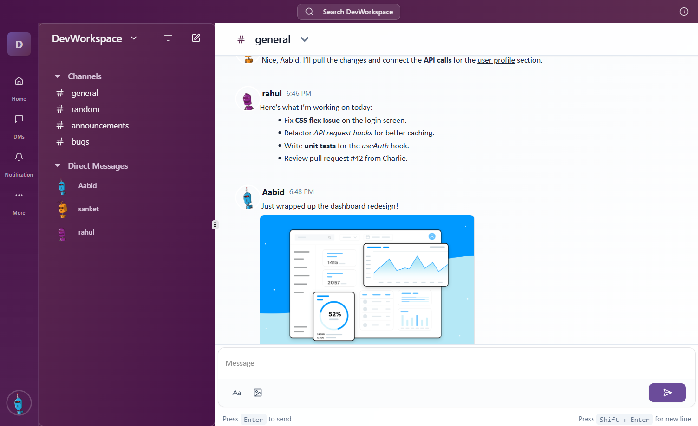

## ChatHive – A professional chat application built with modern technologies. Perfect for team collaboration, project management, and seamless communication.

---

## Screenshots

- Landing :
  
- Authentication (Signup/Signin):
  
- Channel chat (rich text + images):
  
- Workspace list and switcher:
  
- Direct messages:
  

---

Modern, production-style chat app that showcases full‑stack skills: real-time messaging, workspace/channel management, rich text editor, image uploads, role-based actions, and background jobs.

### Why this project stands out

- **End‑to‑end system**: React + Vite frontend, Node/Express + MongoDB backend, real-time with Socket.io, Redis‑backed email queue, Cloudinary uploads.
- **Professional UX**: responsive layout, resizable panels, clean UI, workspace switcher, toasts, loading states.
- **Practical features**: join codes for workspaces, channels, rich text messaging with images, DMs, admin-only actions, JWT auth with optional email verification.

---

## Table of Contents

- Features
- Tech Stack
- Architecture
- Screenshots
- Getting Started
- Environment Variables
- Available Scripts
- API Overview
- Real‑time Events
- Data Models
- Deployment Notes

---

## Features

- **Authentication**
  - Sign up, sign in with JWT. Optional email verification via Nodemailer + queue.
  - Persistent session via `localStorage`.
- **Workspaces**
  - Create, update, delete, and list user’s workspaces.
  - Reset and use an 8‑char join code to onboard teammates.
  - Admin-only actions enforced server-side.
- **Channels and DMs**
  - Channel-based conversations per workspace.
  - One-to-one DMs with room isolation.
  - Rich text editor (Quill): formatting, lists, links.
  - Image uploads via signed Cloudinary requests.
- **Real-time messaging**
  - Socket.io channel and DM rooms with join/leave semantics.
  - Live updates for channel messages and DMs.
- **Polished UI/UX**
  - Workspace switcher, sidebar, resizable panels.
  - Clean loading and error states, toasts, icons.

---

## Tech Stack

- **Frontend**: React 19, Vite, React Router, TanStack Query, Tailwind CSS, Radix UI, Lucide Icons,Quill
- **Backend**: Node.js, Express, Socket.io, Mongoose (MongoDB), Bull (Redis), Nodemailer, Cloudinary
- **Infra**: MongoDB, Redis, Cloudinary, optional email via Gmail SMTP
- **Dev**: ESLint, Vercel config (frontend)

---

## Architecture

- **Monorepo** with `frontend` and `backend`
- **REST API**: `/api/v1/*`
- **JWT-based auth**; token passed via `x-access-token` header
- **Socket.io** namespaces/events for channels and DMs
- **Background job queue** for sending emails (Bull + Redis). Bull Board UI at `/ui`
- **Cloudinary** signed uploads via backend signature endpoint

High-level flow:

- Frontend sends auth requests → Backend returns JWT → Frontend stores JWT and uses it via Axios base config.
- Workspaces/channels fetched with token header.
- On chat screens: join channel/DM rooms, send messages via sockets; backend emits to room; frontend updates state in real-time.
- Images: frontend requests signed params → uploads directly to Cloudinary → sends message with image URL.

---

## Getting Started

### Prerequisites

- Node.js and npm
- MongoDB
- Redis
- Cloudinary account (for image uploads)
- Gmail app password (optional, for email verification)

### 1) Backend

```bash
cd backend
npm install
# create .env (see "Environment Variables")
npm run start
```

- Server listens on `PORT` and exposes:
  - API: `/api/v1/*`
  - Bull Board UI: `/ui`

### 2) Frontend

```bash
cd frontend
npm install
# create .env (see "Environment Variables")
npm run dev
```

- Vite dev server starts; set `VITE_BACKEND_API_URL` and `VITE_BACKEND_SOCKET_URL`.

---

## Environment Variables

### Backend (`backend/.env`)

```env
# Server
PORT=5000
NODE_ENV=development
JWT_SECRET=your_jwt_secret
JWT_EXPIRES_IN=7d

# Mongo
DB_DEV_URL=mongodb://localhost:27017/chathive_dev
DB_PROD_URL=mongodb://localhost:27017/chathive_prod

# Redis
REDIS_HOST=localhost
REDIS_PORT=6379

# Email (optional verification)
MAIL_ID=your_email@gmail.com
MAIL_APP_PASS=your_app_password
ENABLE_EMAIL_VERIFICATION=false

# App meta (used in emails/links)
APP_NAME=ChatHive
APP_LINK=http://localhost:5173

# Cloudinary
CLOUDINARY_CLOUD_NAME=your_cloud_name
CLOUDINARY_API_KEY=your_api_key
CLOUDINARY_API_SECRET=your_api_secret
```

### Frontend (`frontend/.env`)

```env
VITE_BACKEND_API_URL=http://localhost:5000/api/v1
VITE_BACKEND_SOCKET_URL=http://localhost:5000
```

---

## Available Scripts

### Frontend (`frontend/package.json`)

- `npm run dev`: start Vite dev server
- `npm run build`: build for production
- `npm run preview`: preview production build
- `npm run lint`: lint code

### Backend (`backend/package.json`)

- `npm run start`: start server with Nodemon

---

## API Overview

Base URL: `{BACKEND_BASE}/api/v1`

- **Auth**
  - POST `/users/signup`
  - POST `/users/signin`
  - GET `/verify/:token` (email verification callback)
- **Workspaces**
  - GET `/workspace` (user’s workspaces)
  - GET `/workspace/:workspaceId`
  - POST `/workspace`
  - PUT `/workspace/:workspaceId` (update)
  - DELETE `/workspace/:workspaceId`
  - PUT `/workspace/:workspaceId/channels` (add channel)
  - PUT `/workspace/:workspaceId/joinCode/reset`
  - PUT `/workspace/:workspaceId/join` (join via code)
- **Channels**
  - GET `/channels/:channelId`
  - PUT `/channels/:channelId`
- **Messages**
  - GET `/messages/:channelId` (pagination via `?page=&limit=`)
  - GET `/messages/get-signature` (Cloudinary signed params)
- **DMs**
  - GET `/dm/:userId`
  - POST `/dm`

All protected routes require header: `x-access-token: <JWT>`.

---

## Real‑time Events

- **Channel events**
  - `joinChannel` → join channel room
  - `leaveChannel` → leave current channel room
  - `newMessage` → send message to a channel
  - `newMessageReceived` → broadcast to room subscribers
- **Direct Message events**
  - `joinDM` → join DM room (`dm:<sortedUserIds>`)
  - `newDM` → send direct message
  - `newDMReceived` → receive DM in real time

Frontend socket is created in `frontend/src/context/SocketContext.jsx` with `VITE_BACKEND_SOCKET_URL`.

---

## Data Models (MongoDB via Mongoose)

- **User**
  - `email`, `password` (hashed), `username`, `avatar`, `isVerified`, `verificationToken`, `verificationTokenExpiry`
- **Workspace**
  - `name`, `description`, `members[{ memberId, role }]`, `joinCode`, `channels[]`
- **Channel**
  - `name`, `workspaceId`
- **Message**
  - `body`, `image`, `channelId?`, `senderId`, `receiverId?`, `workspaceId?` (+ timestamps)

---

## Deployment Notes

- **Frontend**: Vite app ready for Vercel (`frontend/vercel.json`). Set `VITE_BACKEND_API_URL` and `VITE_BACKEND_SOCKET_URL` in Vercel env.
- **Backend**: Deploy on Render/Railway/EC2 with env vars and attach MongoDB + Redis services. Expose port and CORS (Socket.io CORS `origin: *`).
- **Cloudinary**: configure environment vars in backend.
- **Email**: turn `ENABLE_EMAIL_VERIFICATION=true` and set Gmail app password in prod.

---
